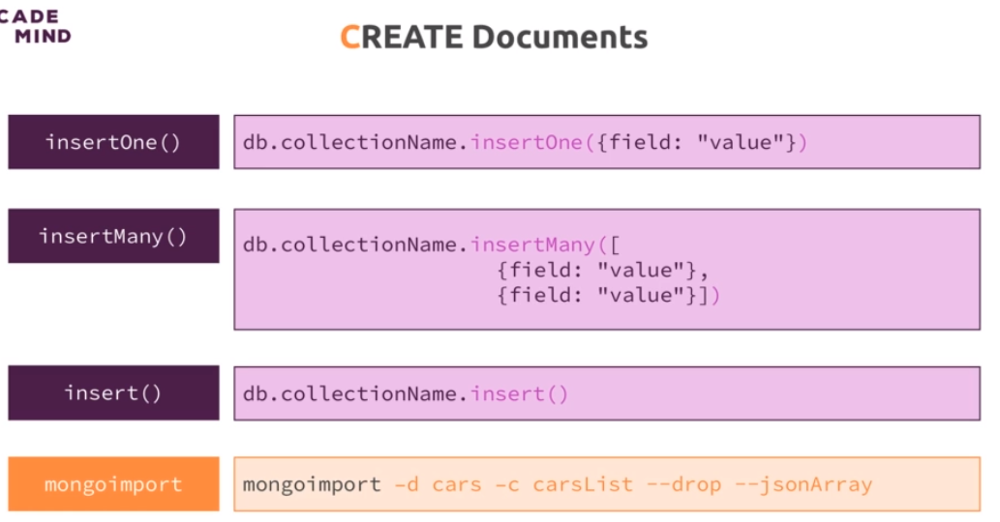
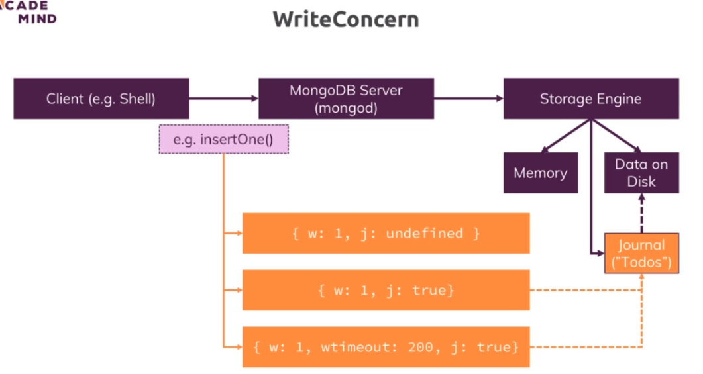
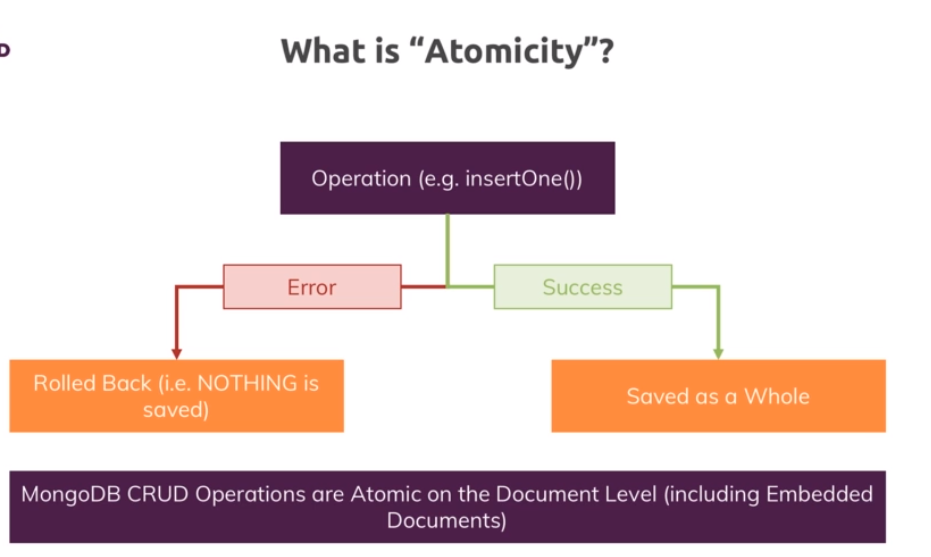
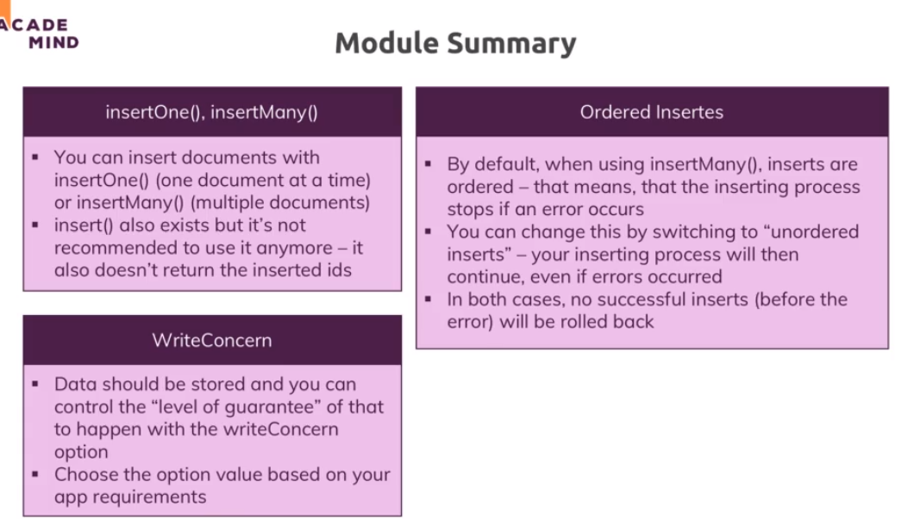

# 4-Create-Operations

1. [Intro](#schema1)
2. [Working with Ordered Inserts](#schema2)
3. [Understanding the `writeConcern`](#schema3)
4. [Atomicity](#schema4)
5. [Importing Data](#schema5)


<hr>

<a name="schema1"></a>

## 1. Intro





En MongoDB, insertOne, insertMany, y insert son métodos que se utilizan para insertar documentos en una colección. 
Aquí hay algunas diferencias clave entre ellos:

**insertOne:**

insertOne se utiliza para insertar un solo documento en una colección.
Recibe un solo documento como argumento, que debe ser un objeto de JavaScript o un documento BSON.
Devuelve un objeto que contiene información sobre la operación de inserción, como el identificador del documento 
insertado.

**insertMany:**

insertMany se utiliza para insertar varios documentos en una colección.
Recibe un array de documentos como argumento, cada uno de los cuales debe ser un objeto de JavaScript o un documento 
BSON.
Devuelve un objeto que contiene información sobre la operación de inserción, incluyendo los identificadores de los 
documentos insertados.

**insert (deprecated):**

El método insert se ha marcado como **obsoleto (deprecated)** y se desaconseja su uso en versiones más recientes de MongoDB.
Se utilizaba para insertar uno o varios documentos, dependiendo de si se le pasaba un solo documento o un array de 
documentos.
A partir de MongoDB 4.2, se recomienda utilizar insertOne o insertMany en lugar de insert.


<hr>

<a name="schema2"></a>

## 2. Working with Ordered Inserts

- Insertamos unos hobbies creando el id único `_id` nosotros.
```
sports> db.hobbies.insertMany([{_id:'sports', name:'Sports'},{_id:'cooking',name:'Cooking'},{_id:'cars', name:'Cars'}])
{
  acknowledged: true,
  insertedIds: { '0': 'sports', '1': 'cooking', '2': 'cars' }
}
sports> db.hobbies.find()
[
  { _id: 'sports', name: 'Sports' },
  { _id: 'cooking', name: 'Cooking' },
  { _id: 'cars', name: 'Cars' }
]
sports> 

```
- Insertamos más hobbies pero repitiendo uno, `Cooking`, dando un error porque se ha duplicado el `_id` y a su vez se 
ha insertado solo un elemento, el anterior al error, en este caso el hoobie `Yoga`. Se insertarán datos hasta que
encuentre un error que parará de insertar elementos.
```
sports> db.hobbies.insertMany([{_id:'yoga', name:'Yoga'},{_id:'cooking',name:'Cooking'},{_id:'hiking', name:'Hiking'}])
Uncaught:
MongoBulkWriteError: E11000 duplicate key error collection: sports.hobbies index: _id_ dup key: { _id: "cooking" }
Result: BulkWriteResult {
  insertedCount: 1,
  matchedCount: 0,
  modifiedCount: 0,
  deletedCount: 0,
  upsertedCount: 0,
  upsertedIds: {},
  insertedIds: { '0': 'yoga' }
}
Write Errors: [
  WriteError {
    err: {
      index: 1,
      code: 11000,
      errmsg: 'E11000 duplicate key error collection: sports.hobbies index: _id_ dup key: { _id: "cooking" }',
      errInfo: undefined,
      op: { _id: 'cooking', name: 'Cooking' }
    }
  }
]
sports> db.hobbies.find()
[
  { _id: 'sports', name: 'Sports' },
  { _id: 'cooking', name: 'Cooking' },
  { _id: 'cars', name: 'Cars' },
  { _id: 'yoga', name: 'Yoga' }
]
sports> 

```
- Cambiamos la sentencia y le añadimos `{ordered:false}` y ahora hace inserta todos lo valores pero el error no.
 Al utilizar `{ordered: false}`, algunos documentos se insertarán y otros no, dependiendo de si hay conflictos 
de clave única.


```
sports> db.hobbies.insertMany([{_id:'yoga', name:'Yoga'},{_id:'cooking',name:'Cooking'},{_id:'hiking', name:'Hiking'}],{ordered: false})
Uncaught:
MongoBulkWriteError: E11000 duplicate key error collection: sports.hobbies index: _id_ dup key: { _id: "yoga" }
Result: BulkWriteResult {
  insertedCount: 1,
  matchedCount: 0,
  modifiedCount: 0,
  deletedCount: 0,
  upsertedCount: 0,
  upsertedIds: {},
  insertedIds: { '2': 'hiking' }
}
Write Errors: [
  WriteError {
    err: {
      index: 0,
      code: 11000,
      errmsg: 'E11000 duplicate key error collection: sports.hobbies index: _id_ dup key: { _id: "yoga" }',
      errInfo: undefined,
      op: { _id: 'yoga', name: 'Yoga' }
    }
  },
  WriteError {
    err: {
      index: 1,
      code: 11000,
      errmsg: 'E11000 duplicate key error collection: sports.hobbies index: _id_ dup key: { _id: "cooking" }',
      errInfo: undefined,
      op: { _id: 'cooking', name: 'Cooking' }
    }
  }
]
sports> db.hobbies.find()
[
  { _id: 'sports', name: 'Sports' },
  { _id: 'cooking', name: 'Cooking' },
  { _id: 'cars', name: 'Cars' },
  { _id: 'yoga', name: 'Yoga' },
  { _id: 'hiking', name: 'Hiking' }
]
sports> 

```


<hr>

<a name="schema3"></a>

## 3. Understanding the `writeConcern`



En MongoDB, el Write Concern (preocupación por la escritura) se refiere al nivel de confirmación que el 
sistema de base de datos debe recibir antes de considerar una operación de escritura como exitosa. 
Específicamente, el Write Concern determina el número de nodos del clúster de MongoDB que deben confirmar 
la operación de escritura antes de que se considere completa.

Algunos conceptos clave asociados con el Write Concern en MongoDB incluyen:

**Acknowledged (Asegurado):** Este es el nivel predeterminado de Write Concern en MongoDB. 
En este nivel, la operación de escritura es confirmada solo cuando el nodo primario (primary) recibe 
la operación y la replica a al menos un número especificado de nodos secundarios (secondaries). 
Este número se puede configurar usando el parámetro `{w:1}` (write concern).


**Unacknowledged (No asegurado):** En este nivel, la operación de escritura se envía al servidor sin esperar 
confirmación. No hay garantía de que la operación se haya realizado correctamente. 
Este nivel se establece mediante { w: 0 }.


**Majority (Mayoría):** Este nivel garantiza que la operación se replica en la mayoría de los nodos del clúster 
(nodos primarios y secundarios) antes de considerarla exitosa. Este nivel se establece mediante { w: "majority" }.


Dentro de la opción writeConcern en MongoDB, puedes especificar varias configuraciones para ajustar el comportamiento 
de las operaciones de escritura. Algunas de las configuraciones adicionales que puedes incluir son:

**wtimeout:** Este parámetro especifica un límite de tiempo (en milisegundos) para la confirmación de la operación 
de escritura. Si la operación no se confirma dentro de este límite, se genera un error.


**fsync:** Este parámetro, cuando se establece en true, asegura que los datos se han sincronizado en disco antes de que 
se considere completa la operación de escritura. Este es un nivel más alto de garantía de durabilidad 
que escribir en el diario.

<hr>

<a name="schema4"></a>

## 4. Atomicity



En MongoDB, el término "atomicidad" se refiere a la propiedad de las operaciones que se ejecutan como una unidad 
atómica e indivisible. En el contexto de bases de datos, una operación atómica es aquella que se ejecuta completamente 
o no se ejecuta en absoluto, y no hay un estado intermedio visible para otros procesos.

En MongoDB, las operaciones de escritura (por ejemplo, inserciones, actualizaciones y eliminaciones) en un solo 
documento son atómicas por naturaleza. Esto significa que si ejecutas una operación de escritura en un solo documento, 
la operación se realiza en su totalidad o no se realiza en absoluto. Otros procesos que acceden al mismo documento 
no verán un estado intermedio durante la operación.

Sin embargo, es importante tener en cuenta que la atomicidad no se extiende automáticamente a operaciones que 
afectan a varios documentos o que involucran transacciones más complejas. MongoDB ofrece ciertas características 
y operaciones que permiten trabajar con transacciones y garantizar niveles más altos de atomicidad:

Operaciones Atómicas en un Solo Documento:

insertOne: Inserta un solo documento atómicamente.
updateOne y updateMany: Actualizan un solo documento o varios documentos atómicamente.
deleteOne y deleteMany: Eliminan un solo documento o varios documentos atómicamente.
Transacciones:

MongoDB a partir de la versión 4.0 admite transacciones en clústeres de replicación.
Puedes utilizar startSession, withTransaction, y las operaciones commitTransaction y abortTransaction para realizar 
operaciones atómicas que involucren varios documentos en una transacción.
Es importante entender y considerar las necesidades de atomicidad en el diseño de tu aplicación y elegir las 
operaciones y características de MongoDB que mejor se adapten a esos requisitos. La atomicidad es un principio 
fundamental en el diseño de bases de datos para garantizar la integridad y consistencia de los datos.


<hr>

<a name="schema5"></a>

## 5. Importing Data

`mongoimport` es una utilidad de línea de comandos proporcionada por MongoDB que te permite importar datos en una base 
de datos MongoDB desde varios formatos de archivo. Puedes utilizar mongoimport para cargar datos en una colección 
MongoDB desde archivos JSON, CSV, TSV (tab-separated values), o BSON.

La sintaxis básica de mongoimport es la siguiente:

```
mongoimport --options <file>
```

Donde --options son las opciones que especifican cómo se deben importar los datos, y <file> es el archivo 
que contiene los datos que deseas importar.

Algunas opciones comunes de mongoimport incluyen:

--host: Especifica el servidor de MongoDB al que te estás conectando.
--db: Especifica la base de datos en la que deseas importar los datos.
--collection: Especifica la colección en la que deseas importar los datos.
--type: Especifica el tipo de archivo de entrada (por ejemplo, json, csv, tsv, bson).
--file: Especifica el archivo que contiene los datos que deseas importar.
--jsonArray: Si el archivo JSON es un arreglo JSON en lugar de un documento por línea.
--headerline: Especifica que la primera línea del archivo CSV/TSV contiene nombres de campo.
Aquí hay un ejemplo básico de uso de mongoimport:

```
mongoimport --host localhost --db miBaseDeDatos --collection miColeccion --type json --file datos.json
```

En este ejemplo, se importan datos desde un archivo JSON llamado datos.json en la colección 
miColeccion de la base de datos miBaseDeDatos en el servidor local.

Recuerda ajustar las opciones según tus necesidades específicas, y ten en cuenta que mongoimport es 
útil para cargar datos iniciales en MongoDB o para importar datos de archivos externos en una base de datos existente.


```
mongoimport tv-shows.json -d movieData -c movies --jsonArray --drop
2023-11-28T11:12:18.697+0100	connected to: mongodb://localhost/
2023-11-28T11:12:18.698+0100	dropping: movieData.movies
2023-11-28T11:12:18.795+0100	240 document(s) imported successfully. 0 document(s) failed to import.


movieData> show collections
movies
movieData> db.movies.find()
[
  {
    _id: ObjectId('6565bd02f59902f29c66619f'),
    id: 1,
    url: 'http://www.tvmaze.com/shows/1/under-the-dome',
    name: 'Under the Dome',
    type: 'Scripted',
    language: 'English',
    genres: [ 'Drama', 'Science-Fiction', 'Thriller' ],
    status: 'Ended',
    runtime: 60,
    premiered: '2013-06-24',
    officialSite: 'http://www.cbs.com/shows/under-the-dome/',
    schedule: { time: '22:00', days: [ 'Thursday' ] },
    rating: { average: 6.5 },
    weight: 91,
    network: {
      id: 2,
      name: 'CBS',
      country: {
        name: 'United States',
        code: 'US',
        timezone: 'America/New_York'
      }

```




